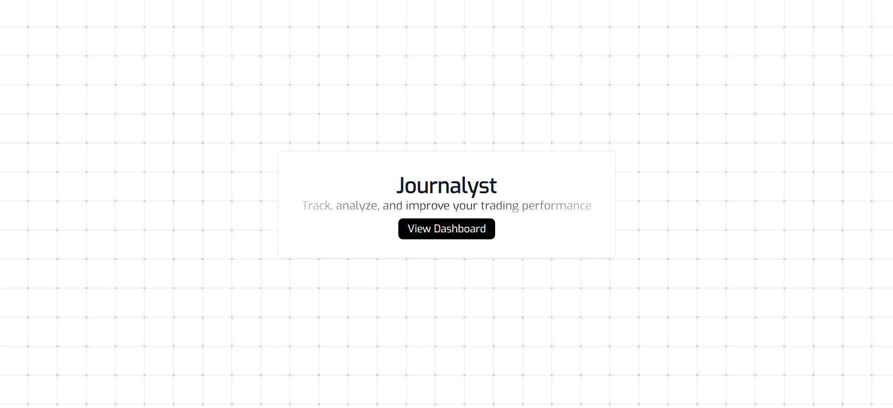
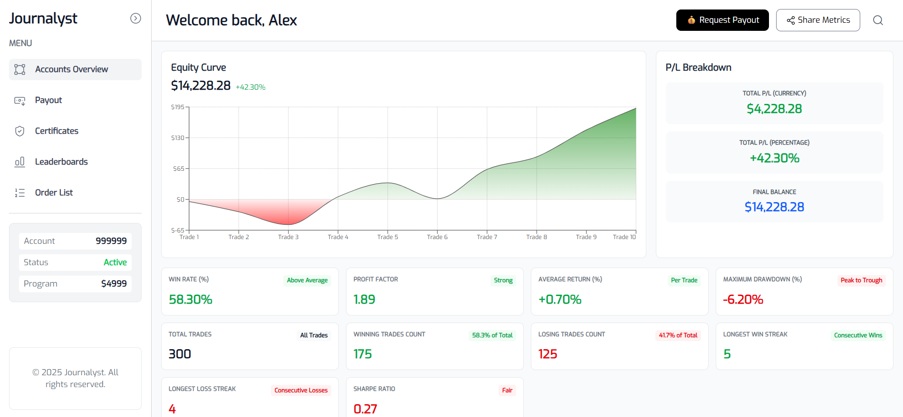
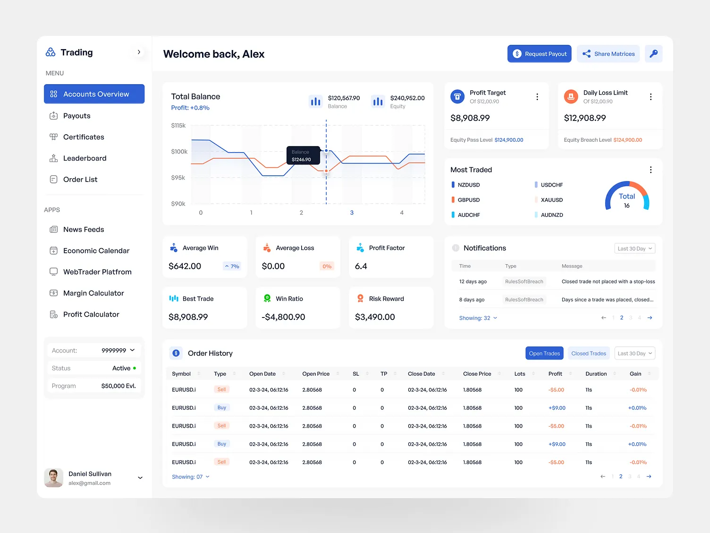

# Trading Analytics Dashboard

A full-stack web application for analyzing trading performance with real-time metrics, charts, and trade history.

## Technical Decisions

**Stack Choice**

Went with a standard React + Express setup. React makes building component-based dashboards straightforward, and keeping the frontend/backend separate means I can deploy them independently. Stayed in the JavaScript ecosystem throughout to avoid context switching.

**State Management**

Used Redux Toolkit even though it might be overkill. The analytics data flows through multiple components (charts, tables, cards), and Redux prevents prop drilling hell. The `createAsyncThunk` helper makes handling loading states and errors cleaner.

**Build & Development**

Vite over Create React App for faster builds and instant HMR. Running both servers separately during development makes debugging easier. Nodemon auto-restarts the backend, Vite handles frontend updates.

**UI & Styling**

Recharts for data visualization—it's declarative and works well with React. Less flexible than D3, but good enough for standard financial charts. Tailwind CSS for styling because utility classes are fast to work with, and the built-in design system keeps things consistent.

**Data & Logging**

Using mock data instead of a real database to move faster. The calculation functions are pure, so swapping in a database later is just changing the data source. Winston for structured logging on the backend to track performance and errors.

**Trade-offs**

Skipped TypeScript to prototype faster (probably should've used it). No server-side rendering since this is a dashboard, not a content site. No tests yet, which I'll regret later. API only has one endpoint right now—would split it up as the app grows.

## Screenshots

### Home Page


### Dashboard UI


### Trade History & Metrics


## Inspiration



This project was inspired by professional trading platforms and the need for comprehensive trading analytics tools. The goal was to create an intuitive, data-driven dashboard that helps traders track performance, visualize trends, and make informed decisions based on historical data.

## Tech Stack

### Frontend
- **React 19** - UI library
- **Vite** - Build tool and dev server
- **Redux Toolkit** - State management
- **React Router** - Client-side routing
- **Recharts** - Data visualization
- **Tailwind CSS** - Styling
- **Axios** - HTTP client
- **Lucide React** - Icons

### Backend
- **Node.js** - Runtime environment
- **Express 5** - Web framework
- **Winston** - Logging
- **CORS** - Cross-origin resource sharing
- **Nodemon** - Development auto-reload

## Prerequisites

Before you begin, ensure you have the following installed:
- **Node.js** (v18 or higher recommended)
- **npm** (v9 or higher) or **yarn**
- **Git** (for version control)

You can verify your installations by running:
```bash
node --version
npm --version
```

## Project Structure

```
├── client/           # Frontend React application
│   ├── src/
│   │   ├── components/   # Reusable UI components
│   │   ├── pages/        # Page components
│   │   ├── store/        # Redux store and slices
│   │   ├── routes/       # Route configurations
│   │   ├── hooks/        # Custom React hooks
│   │   ├── utils/        # Utility functions
│   │   └── constants/    # Constants and configs
│   └── public/       # Static assets
│
└── server/           # Backend Express application
    ├── mock_data/    # Mock data for development
    └── utils/        # Utility functions
```

## Installation & Setup

### 1. Clone the Repository

```bash
git clone <repository-url>
cd temp
```

### 2. Backend Setup

Navigate to the server directory and install dependencies:

```bash
cd server
npm install
```

#### Environment Configuration (Optional)

If your backend requires environment variables, create a `.env` file in the `server` directory:

```bash
# server/.env
PORT=3000
NODE_ENV=development
```

### 3. Frontend Setup

Navigate to the client directory and install dependencies:

```bash
cd ../client
npm install
```

## Running the Application

### Development Mode

You need to run both the backend and frontend servers simultaneously.

#### Option 1: Using Separate Terminals

**Terminal 1 - Start the Backend Server:**
```bash
cd server
npm run start
```
The backend server will start on `http://localhost:3000` (or your configured port).

**Terminal 2 - Start the Frontend Development Server:**
```bash
cd client
npm run dev
```
The frontend will start on `http://localhost:5173` (default Vite port).

#### Option 2: Using a Single Terminal (Windows)

```bash
# From the project root
cd server && start cmd /k "npm run start" && cd ../client && npm run dev
```

### Accessing the Application

Once both servers are running:
- **Frontend**: Open your browser and navigate to `http://localhost:5173`
- **Backend API**: Available at `http://localhost:3000`

## Available Scripts

### Client (Frontend)

| Script | Command | Description |
|--------|---------|-------------|
| Development | `npm run dev` | Starts Vite dev server with hot reload |
| Build | `npm run build` | Builds the app for production |
| Preview | `npm run preview` | Preview production build locally |
| Lint | `npm run lint` | Run ESLint to check code quality |

### Server (Backend)

| Script | Command | Description |
|--------|---------|-------------|
| Start | `npm run start` | Starts the server with Nodemon (auto-reload) |
| Test | `npm run test` | Run tests (currently not configured) |

## Building for Production

### 1. Build the Frontend

```bash
cd client
npm run build
```

This creates an optimized production build in the `client/dist` directory.

### 2. Preview Production Build

```bash
npm run preview
```

### 3. Deploy

- **Frontend**: Deploy the `client/dist` folder to your hosting service (Vercel, Netlify, etc.)
- **Backend**: Deploy the `server` directory to your Node.js hosting service (Heroku, Railway, etc.)

## Troubleshooting

### Port Already in Use

If you get a "port already in use" error:

**Backend:**
- Change the port in your `.env` file or `server.js`
- Or kill the process using the port:
  ```bash
  # Windows
  netstat -ano | findstr :3000
  taskkill /PID <PID> /F
  ```

**Frontend:**
- Vite will automatically suggest an alternative port
- Or specify a port in `vite.config.js`

### Module Not Found Errors

If you encounter module errors:
```bash
# Delete node_modules and reinstall
rm -rf node_modules package-lock.json
npm install
```

### CORS Issues

If you experience CORS errors, ensure the backend CORS configuration allows requests from your frontend URL (default: `http://localhost:5173`).

## Development Notes

- The backend uses **Nodemon** for automatic server restarts during development
- The frontend uses **Vite's HMR** (Hot Module Replacement) for instant updates
- Mock data is available in `server/mock_data/` for testing without a database
- Redux DevTools extension is recommended for debugging state management

## Code Quality

The project uses ESLint for code quality. Run linting before committing:

```bash
cd client
npm run lint
```

## Features

- 📊 **Analytics Dashboard** - Comprehensive trading performance metrics
- 📈 **Interactive Charts** - Equity curves, win rate analysis, and P&L breakdowns
- 📋 **Trade History** - Recent trades table with detailed information
- 🎨 **Responsive Design** - Works on desktop and mobile devices
- ⚡ **Real-time Updates** - Live data updates using React state management
- 🔄 **State Management** - Centralized state with Redux Toolkit

